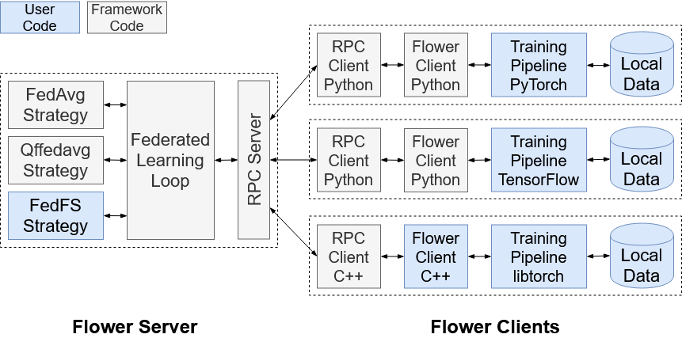

# Federated Learning


The goals of this project is to:
- Create suitable unbalanced dataset, to simulate real world FL system and evaluate corresponding methods.
- Build FL model with existing machine learning framework using basic model aggregation such as averaged weights update ($Fed\Avg$)
- Investigate the effect of parameters: number of clients, rounds, epochs, learning rate, optimisation functions on the global model
Benchmark the FL algorithm, use metrics such as learning accuracy and loss to evaluate model performance and convergence rate by deploying different communication reduction strategies
- Evaluate Biais.


 
# Table of content: 

- [ Technical details]( #Technical-details)
- [ Installation]( #Installation)


## Technical details

#### The Federated learning process 

Federated learning and distributed learning are two different approaches to training machine learning models. In federated learning, a model is trained on multiple decentralized devices or nodes, each having its own local data, and the model updates are averaged and aggregated centrally to update the global model. This allows for privacy-preserving data analysis, as the data never leaves the device. In contrast, in distributed learning, the data is centralized and split across multiple nodes or devices for parallel processing and model training, potentially compromising privacy and data security. Both methods have their own advantages and use cases, but federated learning is especially useful in scenarios where data is distributed across multiple parties and privacy is a concern.

#### The Federated learning using Flower 



## Installation 


```
$ git clone https://github.com/yawoumi/PROJ932

```

### Install poetry using this link 

```
https://python-poetry.org/docs/#installing-with-the-official-installer
```

### Install requirements
```
pip3 install -r requirements
```

### Install dependencies
```
$ => poetry install
```
```
$ => poetry shell
```

### Run the project by using the following command :

```
$ => poetry run ./run.sh
```


